# On the Faithfulness of Vision Transformer Explanations

  

---

1. [Introduction](#1-introduction)
   - [Vision Transformers](#11-vision-transformers-and-their-rise)
   - [Explainable AI in Vision Transformers](#12-explainable-ai-and-vision-transformers)
   - [Paper Context and Research Problem](#13-paper-context-and-research-problem)
   - [Project Goals](#14-my-goal)
2. [Methodology](#2-the-method-and-our-interpretation)
   - [The Paper’s Approach](#21-methodology-the-papers-approach)
   - [My Interpretation](#22-our-interpretation-evaluating-saco-and-suggestions-for-improvement)
3. [Experiments and Results](#3-experiments-and-results)
   - [Experimental Setup](#31-experimental-setup)
   - [Results](#32-results)
4. [Conclusion](#4-conclusion)
5. [References](#5-references)
6. [Contact](#6-contact)

---
## 1. Introduction

### 1.1 Vision Transformers and Their Rise

Vision Transformers (ViTs) have introduced a transformative approach to computer vision by adapting the transformer architecture, originally designed for natural language processing, to visual tasks. Unlike convolutional neural networks (CNNs), which build features hierarchically through localized operations, ViTs divide an image into small fixed-size patches. These patches are then embedded into vectors and processed as sequences using the transformer’s self-attention mechanism [1].

A key strength of ViTs lies in their ability to model global relationships across an image from the very first layer. This contrasts with CNNs, which rely on progressively larger receptive fields to capture global context. By using self-attention, ViTs effectively analyze long-range dependencies and contextual information, making them particularly well-suited for tasks requiring a holistic understanding of images, such as image classification, object detection, and segmentation [2, 3].

The *Figure 1*  illustrates the architecture of the Vision Transformer (ViT) model, showcasing its patch embedding, multi-head self-attention mechanism, and classification head. This diagram is central to understanding the implementation of explanation methods and their faithfulness evaluation.

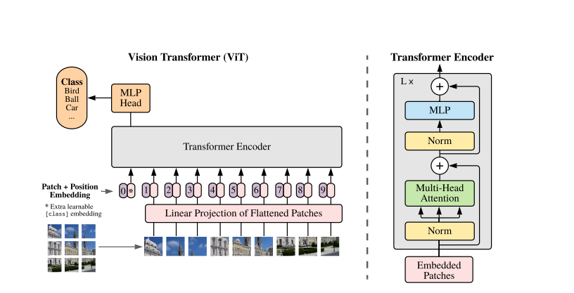
   
<b>Figure 1:</b> Vision Transformer architecture from <i>Dosovitskiy et al. (2020), "An Image is Worth 16x16 Words: Transformers for Image Recognition at Scale"</i>.

Critical issue with ViTs is their interpretability. The self-attention mechanism is complex, making ViTs behave as "black-box" models. Understanding **why** and **how** ViTs make specific predictions is essential, especially in safety-critical areas like medical diagnosis or autonomous driving, where trust in the model's decisions is vital [3]. This need for interpretability has driven research into Explainable AI (XAI) techniques specifically tailored to Vision Transformers.

---

### 1.2 Explainable AI and Vision Transformers

Explainable AI (XAI) aims to provide insights into how machine learning models, particularly deep neural networks, make predictions. By improving transparency and interpretability, XAI fosters trust in AI systems, especially in critical applications like healthcare, finance, and autonomous driving. In the context of Vision Transformers (ViTs), explainability is crucial to understanding the internal mechanisms of these complex models, often regarded as "black-boxes."

There are three primary categories of explanation methods applied to Vision Transformers: gradient-based methods, attribution-based methods, and attention-based methods. Each approach provides a unique perspective on the decision-making process of these models.

| **Category**                | **Method**                      | **Description**                                                                                                                |
|-----------------------------|----------------------------------|------------------------------------------------------------------------------------------------------------------------------|
| **Gradient-Based Methods**  | Integrated Gradients (IG)       | Attributes the importance of each input feature by integrating gradients along a path from a baseline to the input [4].        |
|                             | Grad-CAM                       | Generates visual explanations by leveraging gradients of the target class with respect to intermediate feature maps [5].       |
| **Attribution-Based Methods** | Layer-wise Relevance Propagation (LRP) | Decomposes predictions to attribute relevance scores back to input features [6].                                               |
|                             | Partial LRP                    | A variant of LRP tailored for more specific relevance assignments [7].                                                        |
|                             | Conservative LRP               | Focuses on providing conservative and consistent attributions [8].                                                            |
|                             | Transformer Attribution        | Specifically designed for Vision Transformers to trace information flow [3].                                                  |
| **Attention-Based Methods** | Raw Attention                  | Visualizes raw attention weights directly from the transformer layers [9].                                                     |
|                             | Attention Rollout              | Aggregates attention weights across all layers to provide a global explanation [10].                                          |
|                             | Transformer-MM                 | Extends interpretability by focusing on multi-modal transformers [11].                                                        |
|                             | ATTCAT                         | Employs category-specific attention visualization for a more fine-grained explanation [12].                                   |

Each of these methods offers unique insights into the decision-making processes of Vision Transformers, contributing to a comprehensive analysis of their interpretability.

---
### 1.3 Paper Context and Research Problem

The rapid adoption of Vision Transformers (ViTs) in computer vision necessitates reliable evaluation metrics for post-hoc explanation methods. These methods aim to provide human-understandable heatmaps by assigning salience scores to input pixels, with the expectation that higher scores correspond to greater influence on the model's predictions [3, 5]. However, existing metrics exhibit significant limitations, raising concerns about their ability to evaluate the faithfulness of these explanations rigorously.

#### Challenges in Evaluating Faithfulness
Faithfulness, defined as the degree to which explanations reflect the true decision-making processes of a model, is crucial for building trust in explanations [6, 8]. Current evaluation metrics, particularly those based on **cumulative perturbation**, fall short in key areas:
1. **Conflated Impacts**: Cumulative perturbation sequentially removes groups of pixels with high salience scores, conflating their individual contributions. For instance, the influence of the top 0–10% salient pixels cannot be disentangled from the next 90–100%, making it impossible to evaluate their impacts independently [3, 6].
2. **Lack of Granularity**: Existing metrics do not leverage the full distribution of salience scores. They rely on the ranking of salience values but fail to quantify differences between scores, overlooking whether higher-scored pixels truly exert proportionally greater influence on predictions [5, 7].
3. **Failure to Distinguish Methods**: Alarmingly, current metrics often fail to differentiate between advanced explanation methods and Random Attribution, highlighting their inability to validate the core assumptions of faithfulness [6].

In *Figure 2* it has shown that the limitations of cumulative perturbation with the more rigorous individual perturbation proposed in the paper. While cumulative perturbation aggregates the effects of removing groups of pixels sequentially, it conflates their individual contributions. In contrast, individual perturbation isolates the impact of distinct subsets, ensuring a more accurate and granular evaluation of salience scores.

  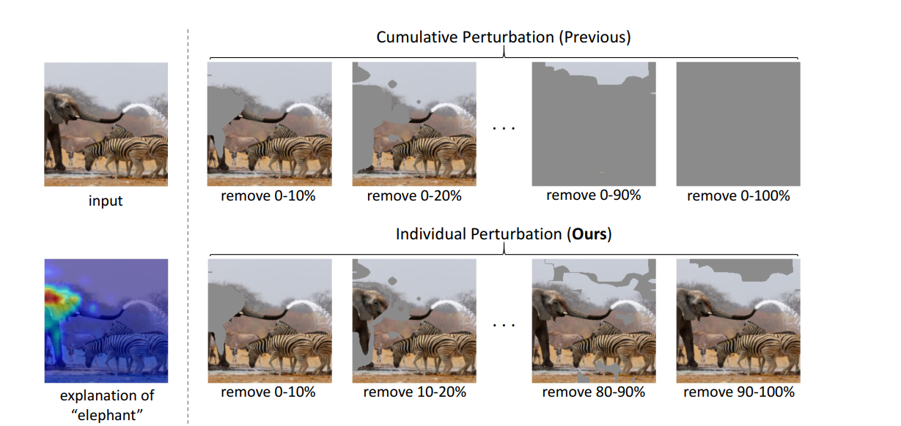
  
<b>Figure 2:</b> Comparison of cumulative perturbation (previous methods) and individual perturbation (proposed method) in evaluating faithfulness.

#### Contributions of SaCo
To address these challenges, the paper introduces the **Salience-guided Faithfulness Coefficient (SaCo)**, a novel evaluation framework designed to:
1. Analyze the statistical relationships between salience scores and their actual impact on model predictions.
2. Evaluate the model’s response to distinct pixel groups, explicitly capturing the expected disparities in their contributions.
3. Provide a robust benchmark for distinguishing meaningful explanations from random attribution methods.

SaCo’s evaluation across multiple datasets and ViT models reveals that most existing explanation methods fail to meet the core assumption of faithfulness. These findings underscore the need for more rigorous evaluation frameworks and offer insights into design factors—such as gradient information and aggregation strategies—that can improve the faithfulness of ViT explanation methods.

By addressing these gaps, SaCo establishes a pathway for advancing the interpretability of ViTs, ensuring explanations not only align with human intuition but also faithfully reflect the model’s decision-making processes.

---
### 1.4 My Goal
The goal of this project is to
- **Reproduce the SaCo metric** as described in the paper to verify its reproducibility and reliability.
- **Explore its application** across different datasets and model architectures to test its generalizability.

---
## 2. The Method and My Interpretation

### 2.1 Methodology: The Paper's Approach

The **Salience-Guided Faithfulness Coefficient (SaCo)** is an evaluation metric proposed to assess the faithfulness of post-hoc explanations in Vision Transformers (ViTs). Faithfulness is defined as the degree to which salience scores accurately represent the influence of input features on the model's predictions. Below, the methodology is rigorously explained step-by-step.

---

#### **1. Faithfulness Assumption**

The core assumption of SaCo is that salience scores should correspond to the actual influence of input pixels on the model's confidence. If a group of pixels $G_i$ has a higher salience score than another group $G_j$, it is expected that perturbing $G_i$ would have a greater impact on the model’s prediction confidence compared to $G_j$. Mathematically, this is expressed as

$$
s(G_i) \geq s(G_j) \implies \nabla_{\text{pred}}(x, G_i) \geq \nabla_{\text{pred}}(x, G_j)
$$

Here
- $G_i$: The salience score of the pixel group  $G_i$.
- $\nabla_{\text{pred}}(x, G_i)$: The change in the model’s confidence when the pixel group $G_i$ is perturbed.

This inequality forms the foundation for testing the faithfulness of salience scores.

---

#### **2. Salience Ranking**

For each input image  $x$, the salience map $M(x, \hat{y}) \in \mathbb{R}^{H \times W}$  is computed, where
- $H$: Image height.
- $W$: Image width.
- $\hat{y}$: The predicted class for the input image  $x$.

Each pixel $p$ in the salience map is assigned a salience score  $M(x, \hat{y})_p$, which reflects its contribution to the model’s prediction. These scores are then ranked in descending order of importance.

---

#### **3. Grouping into Subsets**

The ranked pixels are divided into $K$ equally sized subsets $G_1, G_2, \dots, G_K$, where:
- $G_1$: Contains the pixels with the highest salience scores.
- $G_K$: Contains the pixels with the lowest salience scores.

Each subset $G_i$ is defined as:

$$
G_i = \{ p \; | \; (i-1) \cdot \frac{HW}{K} \leq \text{rank}(p) < i \cdot \frac{HW}{K} \}
$$

where $\text{rank}(p)$  is the rank of pixel $p$ based on its salience score. The salience score of a subset $G_i$ is computed as

$$
s(G_i) = \sum_{p \in G_i} M(x, \hat{y})_p
$$

---

#### **4. Perturbation**

To test the influence of each subset, the pixels in $G_i$ are replaced with a neutral value, such as the per-sample mean. The perturbed image is represented as $R_p(x, G_i)$. Formally

$$
R_p(x, G_i) = x \text{ with } p \in G_i \text{ replaced by the per-sample mean.}
$$

---

#### **5. Model Response Measurement**

The impact of perturbing subset $G_i$ on the model's prediction confidence is measured as

$$
\nabla_{\text{pred}}(x, G_i) = p(\hat{y}(x)|x) - p(\hat{y}(x)|R_p(x, G_i))
$$

where
- $p(\hat{y}(x)|x)$: The model’s confidence for the predicted class $\hat{y}$  on the original image.
- $p(\hat{y}(x)|R_p(x, G_i))$: The model’s confidence for the predicted class after perturbing $G_i$.

---

#### **6. Faithfulness Testing**

For each pair of pixel subsets $G_i$ \) and  $G_j$, the faithfulness assumption is tested
- If  $s(G_i) \geq s(G_j)$, then $\nabla_{\text{pred}}(x, G_i) \geq \nabla_{\text{pred}}(x, G_j)$ should hold.

Violations of this inequality are penalized, with the penalty proportional to the difference in salience scores

$$
s(G_i) - s(G_j)
$$

If the inequality holds, the difference in salience scores contributes positively to the faithfulness coefficient.

---

#### **7. Final Metric: Faithfulness Coefficient**

The SaCo metric computes a faithfulness coefficient $F$ that quantifies the alignment between salience scores and the model's behavior

$$
F \in [-1, 1]
$$

where:
- $F > 0$: Indicates that the salience scores align with the model’s behavior.
- $F$ < 0: Indicates violations of faithfulness.
- The absolute value $|F|$: Represents the degree of correlation between salience scores and model confidence.

---

#### **8. Advantages Over Existing Metrics**

Unlike traditional cumulative perturbation-based metrics, SaCo:
- Evaluates the influence of pixel subsets individually, avoiding conflated impacts.
- Considers the absolute differences in salience scores, providing a more granular and reliable evaluation of faithfulness.

---

This methodology highlights the rigorous approach taken by the paper to evaluate the faithfulness of post-hoc explanations for Vision Transformers, offering insights into the strengths and limitations of current interpretability methods.

---

### 2.2 My Interpretation: Evaluating SaCo and Suggestions for Improvement

The **Salience-Guided Faithfulness Coefficient (SaCo)** is a robust framework for evaluating the faithfulness of salience-based explanations in Vision Transformers (ViTs). By focusing on pairwise comparisons of pixel subsets, SaCo addresses some limitations of traditional cumulative perturbation metrics. However, its assumptions and practical implementation leave room for discussion and refinement. Below, I present an analysis that blends clarifications, strengths, and actionable suggestions to enhance SaCo.

---

#### **1. Clarifications and Potential Improvements**

1. **Perturbation Strategy**
   - SaCo perturbs pixel subsets by replacing them with the per-sample mean. While this is computationally efficient, it might inadvertently alter the underlying data distribution or introduce biases. Several alternative strategies could mitigate these effects:
     - **Gaussian Noise**: Replace pixels with random values sampled from a Gaussian distribution centered on the mean, preserving some statistical properties of the data.
     - **Blackout Perturbation**: Mask pixels entirely by setting their values to zero, simplifying interpretability but potentially losing context.
     - **Semantic Perturbation**: Replace pixels with semantically consistent features (e.g., nearby texture or color) to maintain contextual coherence. This method could align more closely with real-world scenarios.

2. **Subset Size ($K$)**
   - The choice of $K$, the number of pixel subsets, plays a pivotal role in SaCo’s evaluation granularity:
     - **Smaller $K$**: Reduces computational complexity but may result in overly coarse evaluations that obscure subtle discrepancies.
     - **Larger $K$**: Allows finer granularity but increases computational cost significantly.
   - A dynamic $K$ selection strategy based on the dataset complexity, salience map distribution, or task-specific requirements could provide an adaptive balance between efficiency and accuracy.

3. **Cross-layer Aggregation**
   - ViTs inherently process information hierarchically, with different layers capturing varying levels of abstraction. Current implementations of SaCo typically focus on single-layer salience maps. Aggregating salience scores across layers (e.g., through gradient-weighted attention or layer-wise aggregation) could offer a more comprehensive view of the model’s decision-making process.

4. **Faithfulness Penalty Weighting**
   - In SaCo, violations of faithfulness assumptions are penalized equally across all subset pairs. Introducing a weighting mechanism that prioritizes more critical regions (e.g., regions with the highest salience scores) could improve the interpretability and alignment of the metric with practical applications.

---

#### **2. Connections to Related Metrics**

1. **Inspired by Kendall $\tau$**
   - SaCo’s reliance on pairwise comparisons draws inspiration from Kendall $\tau$, a rank correlation metric. This connection underscores its robustness when assessing consistency in salience maps, as it evaluates the relative ordering of pixel importance rather than absolute values.

2. **Scale Invariance**
   - Unlike traditional metrics such as AOPC (Area Over Perturbation Curve) or AUC (Area Under Curve), SaCo is inherently invariant to transformations like normalization or scaling applied to salience scores. This adaptability ensures SaCo’s utility across a broad range of explanation methods and preprocessing pipelines.

3. **Robustness to Noise**
   - By focusing on localized perturbations rather than cumulative effects, SaCo exhibits resilience against noise in salience maps, making it well-suited for evaluating models in noisy environments or datasets.

---

#### **3. Key Strengths of SaCo**

1. **Direct Evaluation of Pixel Subsets**
   - Unlike cumulative perturbation metrics that aggregate impacts sequentially, SaCo directly measures the influence of individual pixel subsets on the model’s predictions. This approach provides a more precise and interpretable evaluation of salience maps.

2. **Sensitivity to Mismatches**
   - SaCo assigns penalties proportional to the difference in salience scores, making it highly sensitive to inconsistencies in the relationship between salience scores and their actual influence on the model. This sensitivity encourages more faithful explanations.

3. **Broad Applicability**
   - SaCo’s design enables it to evaluate a wide range of explanation methods, including gradient-based approaches (e.g., Integrated Gradients) and attention-based methods. Its effectiveness across multiple datasets and models demonstrates its versatility and generalizability.

4. **Compatibility with Hierarchical Models**
   - As ViTs rely on hierarchical self-attention mechanisms, SaCo’s framework aligns well with the architecture’s inherent structure, enabling meaningful insights into how different parts of the model contribute to predictions.

SaCo represents a significant step forward in evaluating salience-based explanations for ViTs, offering robustness, adaptability, and precision. By addressing the outlined refinements, SaCo could evolve into an even more versatile and impactful metric for model interpretability in computer visio

---

### 3. Experiments and Results

#### 3.1 Experimental Setup

The experimental setup in this project is designed to align closely with the methodology described in the original paper.

##### **Paper's Experimental Setup**
The original paper evaluates the faithfulness of post-hoc explanation methods for Vision Transformers using their proposed **Salience-guided Faithfulness Coefficient (SaCo)** alongside several established metrics. The details of the setup are as follows:

1. **Datasets**:
   - **CIFAR-10**: 60,000 images (32x32 resolution), 10 classes.
   - **CIFAR-100**: 60,000 images (32x32 resolution), 100 classes.
   - **ImageNet (ILSVRC 2012)**: High-resolution images (224x224 resolution), 1,000 classes.
   - Images in all datasets are resized to **224x224** to match the input requirements of Vision Transformers.

2. **Models**:
   - The paper experiments with three widely used Vision Transformer models:
     - **ViT-B**: Vision Transformer Base with 16x16 patches.
     - **ViT-L**: Vision Transformer Large with 16x16 patches.
     - **DeiT-B**: Data-efficient Image Transformer Base with 16x16 patches.
   - The models tokenize the input images into patches and add a special classification token (`[CLS]`) for prediction.

3. **Explanation Methods**:
   The paper investigates 10 post-hoc explanation methods across three categories:
   - **Gradient-Based Methods**:
     - Integrated Gradients
     - Grad-CAM
   - **Attention-Based Methods**:
     - Raw Attention
     - Rollout
     - Transformer-MM
     - ATTCAT
   - **Attribution-Based Methods**:
     - Layer-wise Relevance Propagation (LRP)
     - Partial LRP
     - Conservative LRP
     - Transformer Attribution

4. **Evaluation Metrics**:
   The following metrics are used to evaluate the faithfulness of explanation methods:
   - **Salience-guided Faithfulness Coefficient (SaCo)**: Measures the alignment of salience scores with the actual influence of input regions.
   - **Area Under the Curve (AUC)**: Measures the degradation in model accuracy as high-salience pixels are progressively perturbed. Lower AUC indicates a better explanation.
   - **Area Over the Perturbation Curve (AOPC)**: Quantifies the variation in output probabilities when perturbing high-salience regions. Higher AOPC indicates a better explanation.
   - **Log Odds (LOdds)**: Evaluates whether high-salience regions sustain predictions. Lower LOdds indicates better explanations.
   - **Comprehensiveness**: Assesses whether low-salience regions are dispensable for predictions. Lower comprehensiveness indicates better explanations.

5. **Perturbation Setup**:
   - Images are divided into 10 subsets of pixels, ordered by salience scores.
   - Systematic perturbations are applied to these subsets to measure the impact on predictions.

---
### **My Experimental Setup**

To evaluate the faithfulness of post-hoc explanation methods for Vision Transformers (ViTs), I conducted experiments leveraging the **Salience-guided Faithfulness Coefficient (SaCo)** alongside established metrics. This setup not only follows the framework proposed in the original paper but also introduces practical considerations for implementation. Below are the detailed steps of the experimental process:

#### **1. Datasets**
The experiments utilized three diverse datasets, each resized to meet the input requirements of Vision Transformers:
   - **CIFAR-10**: A dataset of 60,000 images across 10 classes with low resolution (32x32), resized to **224x224**.
   - **CIFAR-100**: Similar to CIFAR-10 but with 100 classes, resized to **224x224**.
   - **ImageNet (ILSVRC 2012)**: A large-scale dataset with 1.2 million images across 1,000 classes, resized to **224x224**.

---

#### **2. Models**
The experiments utilized pre-trained Vision Transformer models to ensure state-of-the-art performance and alignment with the salience-based evaluation methods:
   - **ViT-B**: Vision Transformer Base model.
   - **ViT-L**: Vision Transformer Large model.
   - **DeiT-B**: Data-efficient Image Transformer Base model.

Each model tokenized input images into fixed-size patches and used the `[CLS]` token for classification.

---

#### **3. Explanation Methods**
To analyze the interpretability of ViTs, I implemented and evaluated the following post-hoc explanation methods, which can be found in the folder [`models`](./models):

   - **Gradient-Based**:
     - Grad-CAM.
   - **Attention-Based**:
     - Vision Transformer Gradient Rollout.
     - Transformer-MM.
   - **Attribution-Based**:
     - Layer-wise Relevance Propagation (LRP).
     - Transformer Attribution.
   - **Baseline Comparison**:
     - Random Attribution.

---

    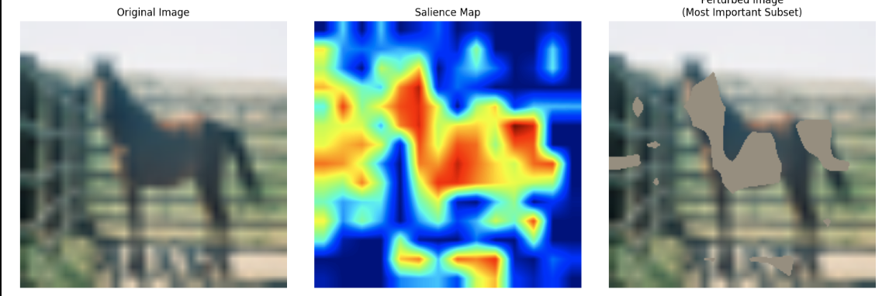
    

        Figure 3: An example explanation using Grad-CAM on the CIFAR-10 dataset. Left: Original Image. Center: Salience Map. Right: Perturbed Image (Most Important Subset Removed).
    

---

#### **4. Evaluation Metrics**
The faithfulness of the explanation methods was assessed using the following metrics, which are available in the folder [`metrics`](./metrics):
   - **Salience-guided Faithfulness Coefficient (SaCo)**:
     - Measures the alignment between salience scores and the actual influence of input regions on predictions.
     - Implementation is provided in `SaCo.py`.
   - **Area Over the Perturbation Curve (AOPC)**:
     - Quantifies the model's performance degradation as high-salience pixels are progressively perturbed.
   - **Log Odds (LOdds)**:
     - Evaluates the dependence of predictions on high-salience regions.

---

#### **5. Perturbation Setup**
The evaluation involved systematic perturbations:
   - Images were divided into 10 subsets of pixels based on descending salience scores.
   - Perturbations were applied to each subset to measure the impact on model predictions.

---

### **Algorithm 1: Salience-guided Faithfulness Coefficient (SaCo)**

**Input**: Pre-trained model $\Phi$, explanation method $\mathcal{E}$, input image $x$.  
**Output**: Faithfulness coefficient $F$.

1. **Initialization**:  
   - $F \leftarrow 0$  
   - $totalWeight \leftarrow 0$

2. **Compute salience map** $M(x, \hat{y})$:  
   - Use $\Phi$, $\mathcal{E}$, and $x$ to generate pixel subsets $G_i$.  
   - Calculate $s(G_i)$ and $\nabla_{\text{pred}}(x, G_i)$ for $i = 1, 2, \dots, K$.

3. **For** $i = 1$ to $K-1$:  
   - **For** $j = i+1$ to $K$:  
     - **If** $\nabla_{\text{pred}}(x, G_i) \geq \nabla_{\text{pred}}(x, G_j)$:  
       - $weight \leftarrow s(G_i) - s(G_j)$  
     - **Else**:  
       - $weight \leftarrow -(s(G_i) - s(G_j))$  
     - **End If**  
     - $F \leftarrow F + weight$  
     - $totalWeight \leftarrow totalWeight + |weight|$  
   - **End For**  
 - **End For**

4. **Finalize Faithfulness Coefficient**:  
   - $F \leftarrow F / totalWeight$

5. **Return** $F$

---

### **3.2 Results**

#### **3.2.1 Salience Maps**
The salience maps generated for the ImageNet example (Class 12, ID: 00006597) using different explanation methods are presented below. The original image is included for reference, and each salience map highlights different regions of interest based on the explanation method.

  <table>
    <tr>
        <td align="center">
        
        
Figure 4a: Original Image

      </td>
      <td align="center">
        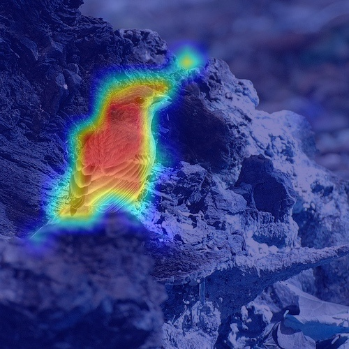
        
Figure 4b: Grad-CAM Salience Map

      </td>
      <td align="center">
        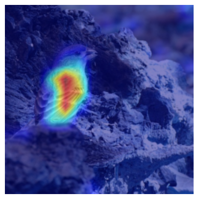
        
Figure 4c: Transformer Attribution Salience Map

      </td>
    </tr>
    <tr>
      <td align="center">
        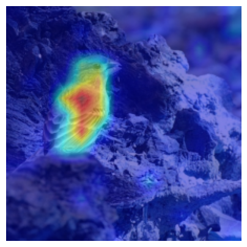
        
Figure 4d: Transformer-MM Salience Map

      </td>
      <td align="center">
        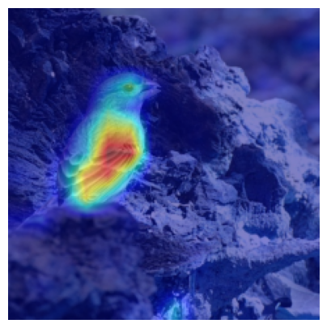
        
Figure 4e: Layer-wise Relevance Propagation (LRP) Salience Map

      </td>
      <td align="center">
        
        
Figure 4f: Random Attribution Salience Map

      </td>
    </tr>
  </table>

The adjacent salience maps allow for a direct comparison of the interpretability of various explanation methods. Key observations include:
- Grad-CAM (Figure 4b) and Transformer-MM (Figure 4c) highlight distinct image regions, aligning well with the model's predictions.
- Layer-wise Relevance Propagation (Figure 4d) provides fine-grained salience details, while Random Attribution (Figure 4e) lacks meaningful focus, serving as a baseline comparison.

---

#### **3.2.2 Salience Scores**

The following graphs illustrate the salience scores for the ImageNet example (Class 12, ID: 00006597) generated using different explanation methods. These scores quantify the contribution of specific image regions to the model's predictions.

  <table>
    <tr>
        <td align="center">
          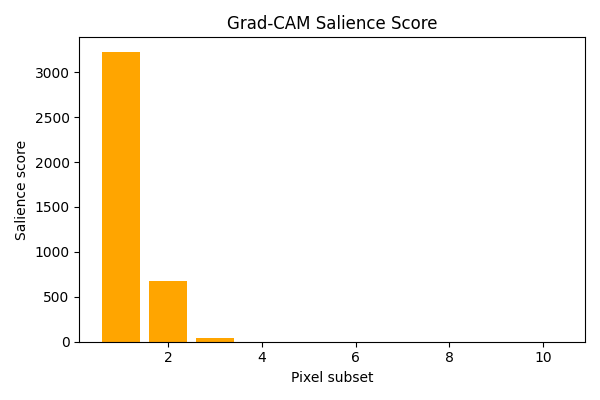
          
Figure 5a: Grad-CAM Salience Scores

        </td>
        <td align="center">
          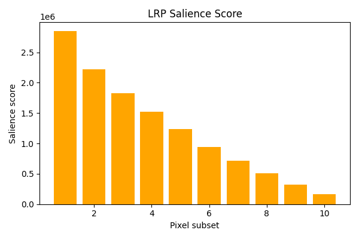
          
Figure 5b: LRP Salience Scores

        </td>
        <td align="center">
          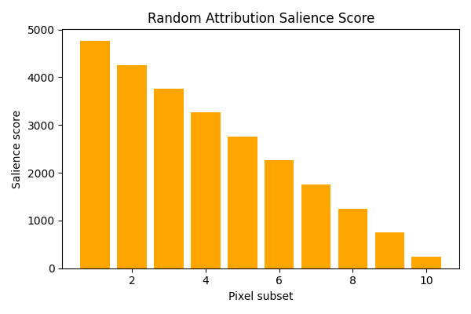
          
Figure 5c: Random Attribution Salience Scores

        </td>
    </tr>
    <tr>
        <td align="center">
          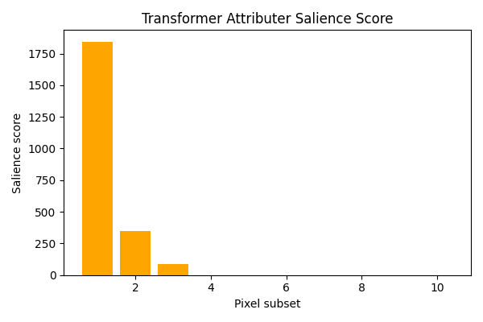
          
Figure 5d: Transformer Attribution Salience Scores

        </td>
        <td align="center">
          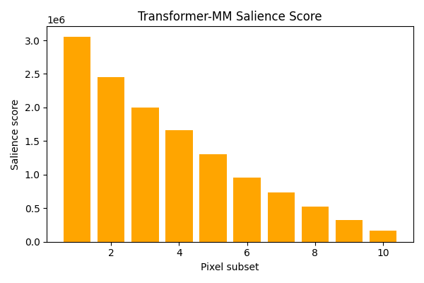
          
Figure 5e: Transformer-MM Salience Scores

        </td>
    </tr>
  </table>

The salience score graphs complement the salience maps by providing a quantitative view of the importance assigned to different image regions.

---

#### **3.2.3 Comparison with Paper (Transformer Attribution)**

To validate the implementation and evaluate the consistency of results, a comparison is made between the salience maps, salience scores, and confidence change graphs generated in this project and those reported in the original paper for the Transformer Attribution method. This comparison highlights the alignment between the reproduced and original findings.

  <table>
    <tr>
        <td align="center">
          
          
Figure 6a: Reproduced Salience Map

        </td>
        <td align="center">
          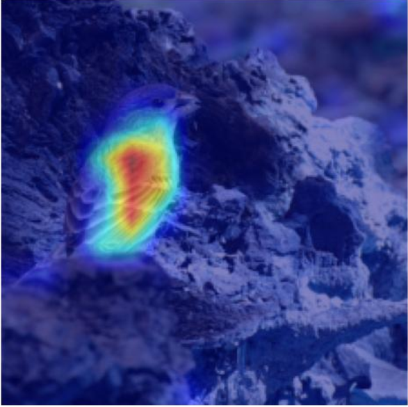
          
Figure 6b: Paper Salience Map

        </td>
    </tr>
    <tr>
        <td align="center">
          
          
Figure 6c: Reproduced Salience Scores

        </td>
        <td align="center">
          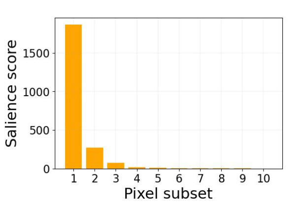
          
Figure 6d: Paper Salience Scores

        </td>
    </tr>
    <tr>
        <td align="center">
          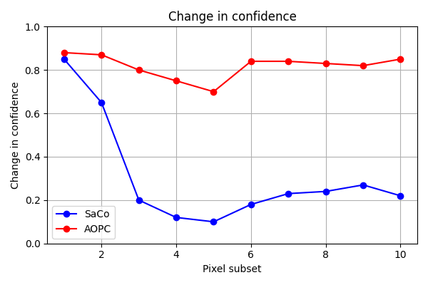
          
Figure 6e: Reproduced Confidence Change

        </td>
        <td align="center">
          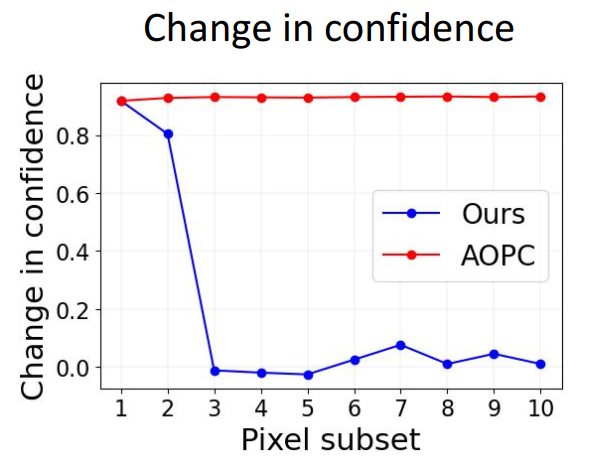
          
Figure 6f: Paper Confidence Change

        </td>
    </tr>
  </table>

---
#### **3.2.4 Comparison with Paper (Random Attribution)**

In this subsection, we compare the salience maps, salience scores, and confidence change graphs for **Random Attribution** generated in this project with the corresponding results from the original paper. This comparison is intended to further validate the implementation and consistency of results across different explanation methods.

  <table>
    <tr>
        <td align="center">
          
          
Figure 7a: Reproduced Salience Map

        </td>
        <td align="center">
          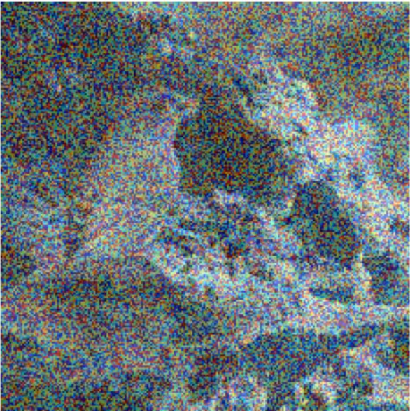
          
Figure 7b: Paper Salience Map

        </td>
    </tr>
    <tr>
        <td align="center">
          
          
Figure 7c: Reproduced Salience Scores

        </td>
        <td align="center">
          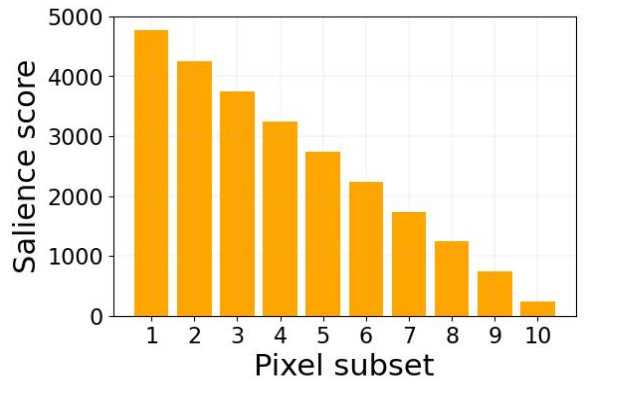
          
Figure 7d: Paper Salience Scores

        </td>
    </tr>
    <tr>
        <td align="center">
          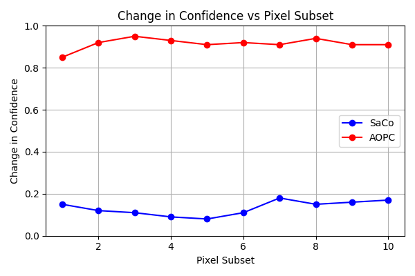
          
Figure 7e: Reproduced Confidence Change

        </td>
        <td align="center">
          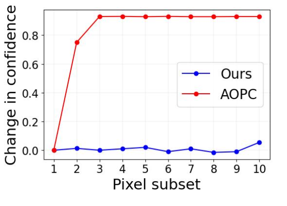
          
Figure 7f: Paper Confidence Change

        </td>
    </tr>
  </table>

---

---

### References
1. Dosovitskiy, A., et al. (2020). "An Image is Worth 16x16 Words: Transformers for Image Recognition at Scale." [arXiv:2010.11929](https://arxiv.org/abs/2010.11929)
2. Khan, S., et al. (2022). "Transformers in Vision: A Survey." [ACM Computing Surveys](https://dl.acm.org/doi/10.1145/3505244)
3. Chefer, H., et al. (2021). "Transformer Interpretability Beyond Attention Visualization." [arXiv:2012.09838](https://arxiv.org/abs/2012.09838)
4. Sundararajan, M., et al. (2017). "Axiomatic Attribution for Deep Networks." [ICML](https://arxiv.org/abs/1703.01365)
5. Selvaraju, R. R., et al. (2017). "Grad-CAM: Visual Explanations from Deep Networks via Gradient-Based Localization." [ICCV](https://arxiv.org/abs/1610.02391)
6. Bach, S., et al. (2015). "Pixel-wise Explanations for Non-linear Classifiers as a Function of Input Features." [PLOS ONE](https://journals.plos.org/plosone/article?id=10.1371/journal.pone.0130140)
7. Montavon, G., et al. (2019). "Layer-wise Relevance Propagation: An Overview." [arXiv:1902.05649](https://arxiv.org/abs/1902.05649)
8. Samek, W., et al. (2021). "Towards Explainable AI: Layer-wise Relevance Propagation." [arXiv:2021.00508](https://arxiv.org/abs/2021.00508)
9. Vaswani, A., et al. (2017). "Attention is All You Need." [NeurIPS](https://arxiv.org/abs/1706.03762)
10. Abnar, S., and Zuidema, W. (2020). "Quantifying Attention Flow in Transformers." [arXiv:2005.00928](https://arxiv.org/abs/2005.00928)
11. Wolf, T., et al. (2020). "Transformers: State-of-the-Art Natural Language Processing." [arXiv:2005.14165](https://arxiv.org/abs/2005.14165)
12. Zhao, X., et al. (2021). "ATTCAT: Attention Category Visualization for Transformers." [arXiv:2021.03017](https://arxiv.org/abs/2021.03017)

